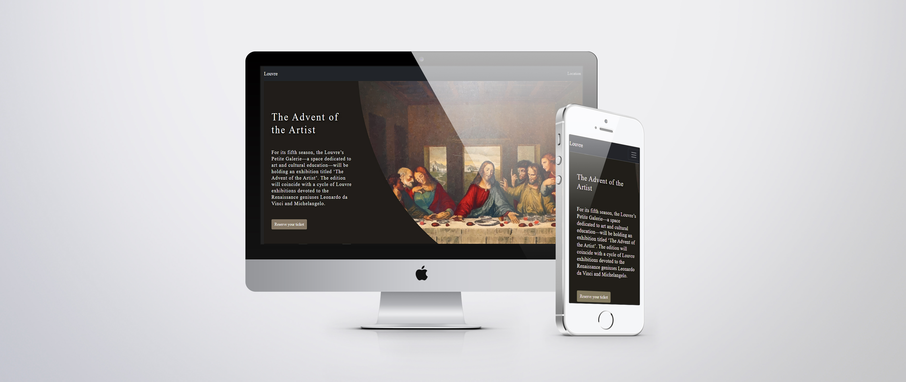

<h1 align="center"> Landin Page Louvre</h1>

<div align="center">
    <h3>
        <a href="https://gustavo-exe.github.io/LouvreLandingPage">
        Demo
        </a>
    </h3>
</div>

## About
Page inspired by a museum, sponsoring one of events.

## Preview and UI



## Built with
- HTML 5
- CSS
- Bootstrap
- micron.js
## Before starting
1. Install:
    * Git 
    * Clonado the repository

2. Open the repository in file explorer with command prompt and run:

```bash
npm install
```


